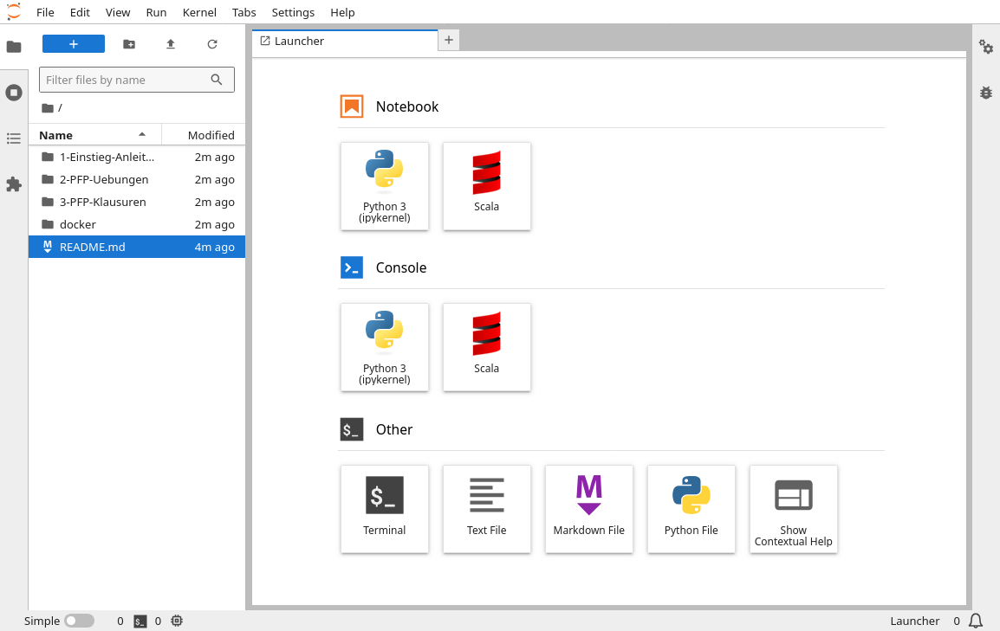

# Übungen zum Scala-Teil der PFP-Vorlesung

Dieses Repository enthält Begleitmaterial und praktische Übungen zum F-Teil der [PFP-Vorlesung](https://www.ps.tf.fau.de/pfp) (Scala).

Um die Aufgaben durchführen zu können, benötigst du:

- Grundkenntnisse in der [Benutzung von JupyterLab](https://jupyter-tutorial.readthedocs.io/de/latest/index.html).
- Grundkenntnisse in der [Programmiersprache Scala](https://www.scala-lang.org/).

Für einen _schnellen Einstieg_ in **Scala+JupyterLab** empfiehlt sich die **[Kurzanleitung hier](1-Einstieg-Anleitung-Allgemeines/Einstieg-Anleitung-Allgemeines.ipynb)**.

## Verwendung im Informatik-CIP-Pool
- Lade das bereitgestellte Archiv herunter und entpacke es in einem beliebigen Verzeichnis (z.B. `~/pfp_scala_jupyterlab`).
- Öffne ein Terminal und wechsle in dieses Verzeichnis (z.B. Rechtsklick auf den Ordner => "Terminal hier öffnen").
- Gib die folgenden beiden Befehle auf der Kommandozeile ein:
  1. `module load pfp`
  2. `jupyter-lab`
  - Der erste Befehl macht den zweiten im CIP erst verfügbar. Nach dem zweiten (und etwas Zeit) sollte sich dein Browser öffnen und in etwa so aussehen:  

- _Diese_ Anleitung (die du gerade liest) kannst du dir ansehen, wenn du mit der rechten Maustaste auf `Readme.md` klickst und _Open With > Markdown Preview_ auswählst.
- **Tipp:** Die CIP-Lösung lässt sich auch z.B. von daheim nutzen:
  - Durch Verwendung eines _Remote Desktops_ - z.B. via [xpra](https://wwwcip.cs.fau.de/documentation/xpra.de.html) oder [VNC](https://de.wikipedia.org/wiki/Virtual_Network_Computing).
  - Durch X-Forwarding (könnte _quälend langsam_ sein...!):
    1. Baue eine SSH-Verbindung mit X-Forwarding auf:
      - `ssh -X cipterm0.cip.cs.fau.de`
    2. Starte `jupyter-lab` auf dem CIP-PC wie oben beschrieben und warte, bis der Browser auf deinem PC erscheint...
  - Durch Port-Weiterleitung via [SSH-Tunnel](https://www.ssh.com/academy/ssh/tunneling) (_funktioniert auch unter Windows_):
    1. Baue eine SSH-Verbindung mit Tunnel auf (ggf. **rechts** "...:8888" durch "...:8889" o.ä. ersetzen):
      - `ssh -L 8888:localhost:8888 cipterm0.cip.cs.fau.de`
    2. Starte `jupyter-lab` auf dem CIP-PC wie oben beschrieben.
      - Wichtig: der von `jupyter-lab` angezeigte Port "...:**XXXX**/lab..." muss mit dem SSH-Tunnel-Port "...localhost:**XXXX**" übereinstimmen!
    3. Rufe im Browser auf dem eigenen PC die angezeigte Adresse (oder `localhost:8888`) auf.

## Verwendung mit Docker
Um die Aufgaben selbst auf _deinem eigenen Laptop oder PC_ durchführen zu können, bietet sich als einfachste Lösung die Verwendung von [Docker](https://www.docker.com/) und dem [Jupyter-Almond-Image](https://hub.docker.com/r/almondsh/almond) an.  

- Stelle sicher, dass du zumindest die [Docker-Engine](https://docs.docker.com/engine/) installiert hast.
- Lade das aktuelle [Jupyter-Almond-Image](https://hub.docker.com/r/almondsh/almond) herunter - z.B.:
  - `docker pull almondsh/almond`
- Starte den Container - z.B.:
  - `docker run -p 8888:8888 -v $(pwd):/home/jovyan/work almondsh/almond`
  - Mit `-p` wird der Port `8888` des Jupyter-Servers auf dem Host bereitgestellt.
  - Mit `-v` wird das aktuelle Verzeichnis `$(pwd)` als Ordner `work` im Container bereitgestellt und später im Browser angezeigt.
    - Idealerweise sollte das der Ordner sein, in dem das bereitgestellte Archiv (siehe "CIP-Pool" oben) entpackt wurde.
  - _Nur falls der Zugriff auf die Dateien verweigert wird_, ergänzen Sie das obige `docker`-Kommando um `:z` nach dem Verzeichnisnamen wie folgt:
    - `docker run -p 8888:8888 -v $(pwd):/home/jovyan/work:z almondsh/almond`
- Am Ende des Startvorgangs erscheint in etwa folgende Ausgabe:
  - `To access the server, open this file in a browser: [...]`
  - `Or copy and paste one of these URLs: [...]`
    - `http://127.0.0.1:8888/lab?token=b20241be...`
  - => Hier einfach den letzten Link in einem Browser öffnen.
- Im Browser erscheint links der Ordner `work`, der die Jupyter-Bücher enthalten sollte (siehe Screenshot oben).
  - Beim ersten Öffnen eines Scala-Buches erscheint eventuell der Dialog `Select Kernel`:
    - => Hier bitte `Scala 3.3` (oder neuer) wählen.
- Den Docker-Container mit dem Jupyter-Server kann man i.d.R. mit `Strg-C` beenden.

## Lokale Installation
Um die Aufgaben selbst auf _deinem eigenen Laptop oder PC_ durchführen zu können, benötigst du für eine vollständige lokale Installation zusätzlich [Python](https://www.python.org/), [Java (JRE)](https://openjdk.org/), [JupyterLab](https://jupyter.org/), [Almond](https://almond.sh/) und einen Browser auf deinem Computer.  
**Tipp:** Falls du _Windows_ verwendest, kannst du anstelle einer allgemeinen _Virtuellen Maschine (VM)_ auch das [_Windows Subsystem for Linux (WSL)_](https://learn.microsoft.com/de-de/windows/wsl/install) (z.B. mit einer _[Ubuntu-App](https://apps.microsoft.com/search?query=ubuntu) aus dem Microsoft Store_) verwenden. Der Rest der Anleitung funktioniert genauso (nur im ersten Schritt WSL statt VirtualBox+VM installieren).

- Falls du keine Software selbst installieren möchtest oder darfst, empfiehlt sich ggf. die Installation in einer _Virtuellen Maschine (VM)_ - z.B.:
  - Stelle sicher, dass du eine Virtualisierung (z.B. [VirtualBox](https://www.virtualbox.org/)) installiert hast.
  - Erstelle eine VM mit einem aktuellen [Xubuntu LTS](https://xubuntu.org/) (eine _"Minimal"_-Installation genügt).
  - Ergänze anschließend in dieser Reihenfolge:
    - `sudo apt-get install bzip2 make gcc perl curl`
    - optional (aber sinnvoll): _VirtualBox Guest Additions_
    - `sudo snap install firefox`
- Wenn nicht schon vorhanden, musst du [Python](https://www.python.org/downloads/) installieren.
- Ggf. musst du im folgenden [`pipx`](https://wiki.ubuntuusers.de/pipx/) (statt `pip`) verwenden - z.B.:
  - `sudo apt-get install pipx`
  - `python3 -m pipx ensurepath`
- Ist Python installiert, geht es mit der Installation von [JupyterLab](https://jupyter.org/) weiter - z.B.:
  - `pipx install jupyterlab`
- Wenn nicht schon vorhanden, musst du [Java](https://openjdk.org/) installieren (ein _"JRE"_ genügt) - z.B.:
  - `sudo apt-get install openjdk-21-jre`
- Zum Schluss ist die Installation von [Almond](https://almond.sh/) an der Reihe:
  - `curl -Lo coursier https://git.io/coursier-cli`
  - `chmod +x coursier`
  - `./coursier launch almond --scala 3.3.3 -- --install`
  - `rm -f coursier`